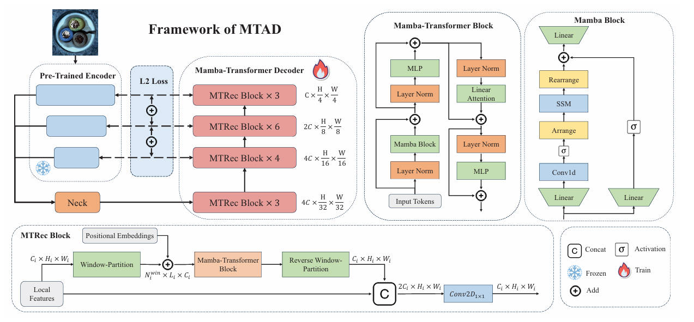

# MTAD-KBS
The official code of the paper " *Integrating Local and Global Correlations with Mamba-Transformer for Multi-Class Anomaly Detection*", which is accepted by "Knowledge-based Systems".


## Abstract

Unsupervised anomaly detection (UAD) tasks play a vital role in detecting anomaly features from industrial data, and handling these tasks can improve the quality and efficiency of industrial pro duction. Although the transformer-based reconstruction techniques have demonstrated remarkable successes in UAD, their efficacy is still constrained by the quadratic computational complexity and the absence of local information extracted by the convolutional module. To address these issues, this paper proposes a Mamba-Transformer based method (named MTAD) for multi-class anomaly detection. The MTAD method aims to leverage the strengths of Mamba’s long-range modeling capabilities and linear efficiency, while integrating local information into the reconstruction process. To integrate the local information with global information, this paper proposes a MTRec block as the core module of the Mamba-Transformer decoder. Specifically, the MTRec block employs a novel Mamba-Transformer block to reconstruct the global window-partition features, and employs a convolutional module to fuse the global information and local information. Additionally, the Mamba Transformer block incorporates Mamba block and linear attention module to enhance the global modeling capability and address the quadratic complexity issue. Moreover, the Mamba block arranges and rearranges the feature tokens by a selected scanning method to improve the position-awareness of the model and maintain the spatial continuity. Finally, the reconstructed multi-scale features are aggregated to calculate reconstruction errors with more refined prediction accuracy. Experimental results demonstrate that the proposed method is effective and can surpass the state-of-the-art methods.


## Overview



## Getting Started

- Clone this repo to [ADer](https://github.com/zhangzjn/ADer).

- `conda install -c conda-forge accimage -y && conda install -c conda-forge faiss-cpu -y &&apt-get update&&apt-get install ffmpeg libsm6 libxext6 -y&& apt-get install libgl1 -y  && pip install -r requirements.txt &&python -c "from opencv_fixer import AutoFix; AutoFix()" && cd dis_causal_conv1d && pip install -e . && cd .. &&cd dis_mamba && pip install -e . && cd ..  && CUDA_VISIBLE_DEVICES=0 python run.py -c configs/tmad/tmad_256_500e_mvtec.py -m train`

## Citation

If you find this code useful, don't forget to star the repo and cite the paper:

```
@article{MA2025113740,
title = {Integrating local and global correlations with Mamba-Transformer for multi-class anomaly detection},
journal = {Knowledge-Based Systems},
pages = {113740},
year = {2025},
issn = {0950-7051},
doi = {https://doi.org/10.1016/j.knosys.2025.113740},
url = {https://www.sciencedirect.com/science/article/pii/S0950705125007865},
author = {Zeqi Ma and Jiaxing Li and Kaihang Jiang and Wai Keung Wong},
keywords = {Mamba, Transformer, Multi-class, Anomaly detection}
}
```


## Acknowledgements

We thank the great works [ADer](https://github.com/zhangzjn/ADer), [MambaAD](https://github.com/lewandofskee/MambaAD), [VMamba](https://github.com/MzeroMiko/VMamba) [Vim](https://github.com/hustvl/Vim.git) for providing assistance for our research.